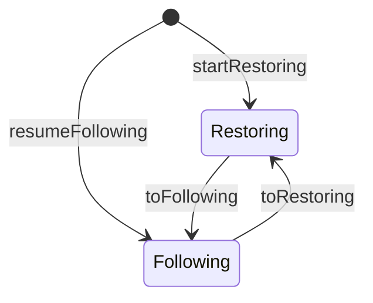

# Backend Interface

The backend interface ([source][backend-src]) defines how user code plugs into
the chain follower. It uses a continuation-passing style (CPS) where each
operation returns the next continuation, forming a state machine without mutable
references.

[backend-src]: https://github.com/lambdasistemi/chain-follower/blob/feat/rollback-support/lib/ChainFollower/Backend.hs

## CPS Continuation Pattern

The backend provides two record types, one per phase:

```haskell
data Restoring m t block inv = Restoring
    { restore    :: block -> t (Restoring m t block inv)
    , toFollowing :: m (Following m t block inv)
    }

data Following m t block inv = Following
    { follow       :: block -> t (inv, Following m t block inv)
    , toRestoring  :: m (Restoring m t block inv)
    , applyInverse :: inv -> t ()
    }
```

Each record has:

- A **block processing function** that runs in the transaction monad `t`. It
  returns the next continuation (and in following mode, the inverse operations).
- A **phase transition function** that runs in the outer monad `m` (typically
  IO). Transitions may involve replaying journals, opening cursors, or other
  side effects.

### Why CPS

The CPS pattern avoids mutable state. Each call to `restore` or `follow`
returns a fresh continuation that captures the updated internal state. The chain
follower holds onto the latest continuation and never needs an `IORef` or `MVar`
for backend state.

This also makes the interface pure from the chain follower's perspective: given
a continuation, calling it always produces a deterministic next step.

## Phase Transitions



- **toFollowing** -- runs in `m`. The backend may replay a journal, build
  indexes, or enable query paths. Returns a `Following` continuation.
- **toRestoring** -- runs in `m`. The backend may disable queries, flush
  caches, or enter bulk-write mode. Returns a `Restoring` continuation.

The chain follower decides when to transition based on proximity to the chain
tip.

## Init

```haskell
data Init m t block inv = Init
    { startRestoring  :: m (Restoring m t block inv)
    , resumeFollowing :: m (Following m t block inv)
    }
```

The backend provides setup actions for both phases. The chain follower picks one
based on its checkpoint state:

- **startRestoring** -- no checkpoint or starting fresh. The backend initializes
  for bulk ingestion.
- **resumeFollowing** -- resuming near the tip. The backend replays journals,
  restores cursors, etc.

Only the chosen branch is executed; the other is never called.

## Lifting

When the backend operates over its own column GADT but the chain follower uses a
larger unified GADT (including both backend columns and the rollback column),
the continuations must be lifted.

```haskell
liftRestoring :: (Functor m, Functor t)
    => (forall a. t a -> t' a)
    -> Restoring m t block inv -> Restoring m t' block inv

liftFollowing :: (Functor m, Functor t)
    => (forall a. t a -> t' a)
    -> Following m t block inv -> Following m t' block inv

liftInit :: (Functor m, Functor t)
    => (forall a. t a -> t' a)
    -> Init m t block inv -> Init m t' block inv
```

The natural transformation is typically `mapColumns SomeConstructor` from
`kv-transactions`, which embeds one GADT into a larger one.

## How to Implement a Backend

1. **Define a column GADT** for your backend's storage:

    ```haskell
    data MyColumns c where
        MyKV :: MyColumns (KV Key Value)
    ```

2. **Implement `follow`** -- process a block, return the inverse:

    ```haskell
    follow :: Block -> Transaction m cf MyColumns op (Inv, Following ...)
    ```

3. **Implement `restore`** -- process a block with no inverse:

    ```haskell
    restore :: Block -> Transaction m cf MyColumns op (Restoring ...)
    ```

4. **Implement `applyInverse`** -- undo one inverse operation:

    ```haskell
    applyInverse :: Inv -> Transaction m cf MyColumns op ()
    ```

5. **Provide `Init`** with `startRestoring` and `resumeFollowing`.

6. **Lift** into the unified column type using `liftInit`:

    ```haskell
    data AllCols c where
        InBackend  :: MyColumns c -> AllCols c
        Rollbacks  :: AllCols (RollbackKV Slot Inv ())

    liftedInit = liftInit (mapColumns InBackend) myInit
    ```
