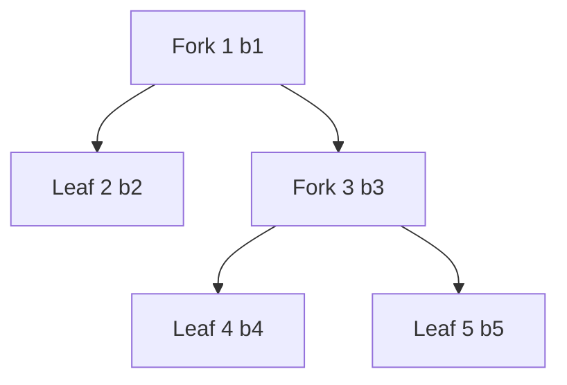

# MockChain

The MockChain module ([source][mock-src]) models a blockchain with forks as a
rose tree. It provides deterministic traversals for testing chain followers
against fork-heavy scenarios.

[mock-src]: https://github.com/lambdasistemi/chain-follower/blob/feat/rollback-support/lib/ChainFollower/MockChain.hs

## BlockTree

```haskell
data BlockTree slot block
    = Leaf slot block
    | Fork slot block [BlockTree slot block]
```

A rose tree parameterized over slot and block types. Children are ordered:
leftmost is explored first, rightmost is the canonical chain.



In this tree, the canonical path is `1 -> 3 -> 5` (rightmost at each level).

## ChainEvent

```haskell
data ChainEvent slot block
    = Forward slot block
    | RollBack slot
```

The stream of events a chain follower sees: new blocks rolling forward and
rollbacks to earlier slots.

## Tree Operations

### dfs

```haskell
dfs :: BlockTree slot block -> [ChainEvent slot block]
```

Deterministic left-to-right DFS walk. Between sibling subtrees, emits a
`RollBack` to the parent slot. This is what the chain follower sees when
processing a forking chain.

For the tree above:

```
Forward 1 b1, Forward 2 b2, RollBack 1, Forward 3 b3, Forward 4 b4, RollBack 3, Forward 5 b5
```

Mirrors the Lean `dfs` function in `ChainFollower/BlockTree.lean`.

### canonicalPath

```haskell
canonicalPath :: BlockTree slot block -> [(slot, block)]
```

Extracts the rightmost path from root to leaf. This is the final chain state
after all forks are resolved.

For the tree above: `[(1, b1), (3, b3), (5, b5)]`.

### resolveCanonical

```haskell
resolveCanonical :: Ord slot => [ChainEvent slot block] -> [(slot, block)]
```

Folds a flat event list into the canonical chain. Each `Forward` appends to the
accumulator; each `RollBack target` drops entries with slot > target.

This is the reference implementation: if a chain follower processes the DFS walk
correctly, its final state must match `resolveCanonical (dfs tree)`, which
equals `canonicalPath tree`.

## Well-formedness

### wellFormed

```haskell
wellFormed :: Int -> BlockTree slot block -> Bool
```

A tree is well-formed with respect to stability window K if every
non-rightmost subtree has depth at most K and all subtrees are recursively
well-formed.

This constraint ensures rollbacks never exceed the stability window. The
rightmost (canonical) branch can grow without bound; only side branches are
depth-limited.

### depth

```haskell
depth :: BlockTree slot block -> Int
```

Maximum depth from root to any leaf.

## Relationship to Lean BlockTree

The Haskell `BlockTree` mirrors the Lean formalization in
`lean/ChainFollower/BlockTree.lean`. The key correspondence:

| Haskell | Lean |
|---------|------|
| `Leaf s b` | `BlockTree.leaf s b` |
| `Fork s b cs` | `BlockTree.fork s b cs` |
| `dfs` | `dfs` |
| `canonicalPath` | `canonical` |
| `wellFormed k` | `wellFormed k` |
| `depth` | `depth` |

The Lean formalization proves `dfs_equiv_canonical`: for any well-formed tree
and a backend satisfying `swap_inverse_restores`, processing the DFS walk
produces the same state as applying the canonical path.
