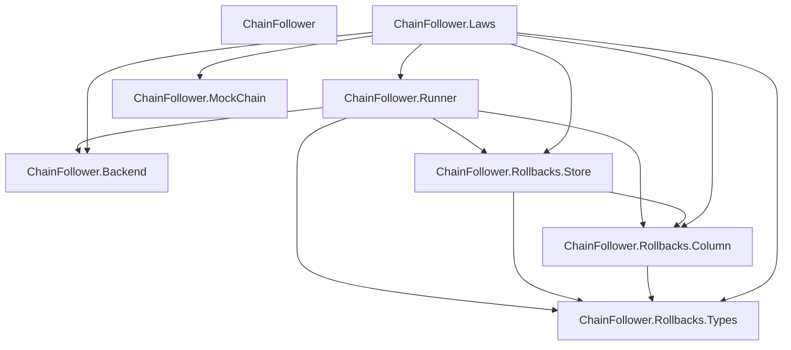

# Module Map

All library modules live under `lib/ChainFollower/`. The top-level
`ChainFollower` module re-exports the public API types.

## Modules

| Module | Purpose |
|--------|---------|
| [`ChainFollower`][m-top] | Top-level re-exports: `Follower`, `Intersector`, `ProgressOrRewind` |
| [`ChainFollower.Backend`][m-backend] | CPS backend interface: `Restoring`, `Following`, `Init`, lifting functions |
| [`ChainFollower.Runner`][m-runner] | State machine: `Phase`, `processBlock`, `rollbackTo`, `pruneOldPoints` |
| [`ChainFollower.Rollbacks.Types`][m-types] | Core types: `Operation`, `inverseOf`, `RollbackPoint` |
| [`ChainFollower.Rollbacks.Store`][m-store] | Transaction-level rollback operations: store, query, rollback, prune, armageddon |
| [`ChainFollower.Rollbacks.Column`][m-column] | `RollbackColumn` GADT, `RollbackKV` and `RollbackCol` type aliases |
| [`ChainFollower.MockChain`][m-mock] | `BlockTree`, `ChainEvent`, DFS walk, canonical path extraction |
| [`ChainFollower.Laws`][m-laws] | Testable backend laws: `BackendHarness`, three QuickCheck properties |

[m-top]: https://github.com/lambdasistemi/chain-follower/blob/feat/rollback-support/lib/ChainFollower.hs
[m-backend]: https://github.com/lambdasistemi/chain-follower/blob/feat/rollback-support/lib/ChainFollower/Backend.hs
[m-runner]: https://github.com/lambdasistemi/chain-follower/blob/feat/rollback-support/lib/ChainFollower/Runner.hs
[m-types]: https://github.com/lambdasistemi/chain-follower/blob/feat/rollback-support/lib/ChainFollower/Rollbacks/Types.hs
[m-store]: https://github.com/lambdasistemi/chain-follower/blob/feat/rollback-support/lib/ChainFollower/Rollbacks/Store.hs
[m-column]: https://github.com/lambdasistemi/chain-follower/blob/feat/rollback-support/lib/ChainFollower/Rollbacks/Column.hs
[m-mock]: https://github.com/lambdasistemi/chain-follower/blob/feat/rollback-support/lib/ChainFollower/MockChain.hs
[m-laws]: https://github.com/lambdasistemi/chain-follower/blob/feat/rollback-support/lib/ChainFollower/Laws.hs

## Dependency Diagram

## Layer Structure

The modules form three layers:

**Core types** -- `Rollbacks.Types` and `Rollbacks.Column` define the data model
with no runtime dependencies.

**Storage** -- `Rollbacks.Store` provides cursor-based operations over the
rollback column, using `kv-transactions`.

**Orchestration** -- `Runner` is the state machine that ties `Backend` and
`Store` together. `Backend` defines the CPS interface that user code implements.

**Testing** -- `MockChain` and `Laws` sit outside the runtime path. They provide
generators and testable properties for verifying backend implementations.
