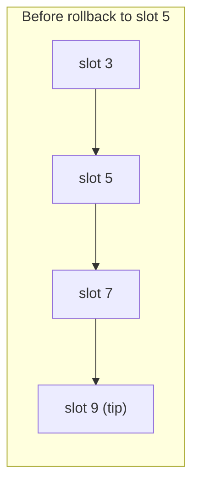
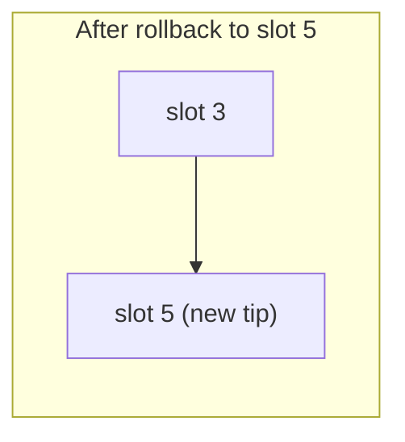

# Rollback Store

The rollback store ([source][store-src]) provides transaction-level operations
for storing and replaying inverse operations. It is a key-value column where
the key is a slot (or slot-like type) and the value is a `RollbackPoint`.

[store-src]: https://github.com/lambdasistemi/chain-follower/blob/feat/rollback-support/lib/ChainFollower/Rollbacks/Store.hs

## RollbackPoint

```haskell
data RollbackPoint inv meta = RollbackPoint
    { rpInverses :: [inv]
    , rpMeta     :: Maybe meta
    }
```

Each point stores:

- **rpInverses** -- a list of inverse operations to replay on rollback. The type
  `inv` is backend-defined (e.g. `Operation key value` for simple KV stores, or
  a domain-specific sum type).
- **rpMeta** -- optional per-point metadata (block hash, merkle root, etc.). Set
  to `()` when not needed.

## Storage Model

The rollback column is a sorted key-value map:

```
key (slot)  ->  RollbackPoint inv meta
```

Keys are ordered by the `Ord` instance on the slot type. The store uses
cursor-based iteration from `kv-transactions` to walk forward or backward
through the column.

The column is defined as a GADT in
[`Rollbacks.Column`](https://github.com/lambdasistemi/chain-follower/blob/feat/rollback-support/lib/ChainFollower/Rollbacks/Column.hs):

```haskell
type RollbackKV key inv meta = KV key (RollbackPoint inv meta)
type RollbackCol t key inv meta = t (RollbackKV key inv meta)
```

## Operations

### storeRollbackPoint

```haskell
storeRollbackPoint :: RollbackCol t key inv meta -> key -> RollbackPoint inv meta -> Transaction m cf t op ()
```

Inserts a rollback point at the given key. Called by the Runner during
`processBlock` in following mode.

### queryTip

```haskell
queryTip :: RollbackCol t key inv meta -> Transaction m cf t op (Maybe key)
```

Returns the last (highest) key in the column, or `Nothing` if empty. Used to
check current tip position.

### rollbackTo

```haskell
rollbackTo
    :: RollbackCol t key inv meta
    -> (RollbackPoint inv meta -> Transaction m cf t op ())
    -> key
    -> Transaction m cf t op RollbackResult
```

Rolls back to the target key:

1. Seeks to the target key. If not found, returns `RollbackImpossible`.
2. Positions the cursor at the last (tip) entry.
3. Walks backward, for each entry strictly after the target:
    - Calls the callback with the `RollbackPoint` (which applies inverses).
    - Deletes the entry.
4. Stops when reaching the target key (kept intact).
5. Returns `RollbackSucceeded n` with the count of deleted points.





Slots 7 and 9 are deleted; their inverses are applied in order 9, 7.

### pruneBelow

```haskell
pruneBelow :: RollbackCol t key inv meta -> key -> Transaction m cf t op Int
```

Deletes all entries with keys strictly less than the given key. Walks forward
from the first entry. Returns the number of pruned points.

Used for finality management: once a slot is finalized, its rollback point
(and all earlier ones) will never be needed.

### armageddonCleanup

```haskell
armageddonCleanup :: RollbackCol t key inv meta -> Int -> Transaction m cf t op Bool
```

Batch-deletes entries from the front of the column. Returns `True` if more
entries remain (caller should loop). The batch size parameter controls how many
entries are deleted per transaction, keeping individual transactions small.

Used when rollback is impossible (target not found) and a full database reset is
required.

### armageddonSetup

```haskell
armageddonSetup :: RollbackCol t key inv meta -> key -> Maybe meta -> Transaction m cf t op ()
```

Inserts a sentinel rollback point with empty inverses. Call after
`armageddonCleanup` completes, or on fresh database initialization. The
sentinel key should sort before all block slots (e.g. origin, 0, `Nothing`).
