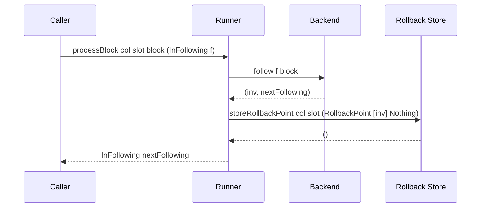

# Runner

The Runner ([source][runner-src]) is the chain follower state machine. It holds
the current `Phase` and manages block processing, rollbacks, and finality
pruning.

[runner-src]: https://github.com/lambdasistemi/chain-follower/blob/feat/rollback-support/lib/ChainFollower/Runner.hs

## Phase

```haskell
data Phase m cf col op block inv
    = InRestoration (Restoring m (T m cf col op) block inv)
    | InFollowing   (Following m (T m cf col op) block inv)
```

The chain follower is always in one of two phases:

- **InRestoration** -- bulk ingestion, no rollback support. The backend processes
  blocks at full speed without computing inverses.
- **InFollowing** -- near the chain tip, rollback support active. Each block
  produces inverse operations stored in the rollback column.

Phase transitions happen via the backend's `toFollowing` / `toRestoring`
continuations, which run in the outer monad (typically IO).

## processBlock

```haskell
processBlock
    :: (Ord slot, GCompare col, Monad m)
    => RollbackCol col slot inv ()
    -> slot
    -> block
    -> Phase m cf col op block inv
    -> T m cf col op (Phase m cf col op block inv)
```

Behavior depends on the current phase:

**Restoration mode** -- calls `restore` on the backend continuation. No inverse
operations, no rollback storage. Returns the next `InRestoration` phase.

**Following mode** -- calls `follow` on the backend continuation, which returns
`(inv, next)`. The inverse is wrapped in a `RollbackPoint` and stored
atomically in the same transaction via `Rollbacks.storeRollbackPoint`. Returns
the next `InFollowing` phase.

!!! note "Transaction atomicity"
    The backend's column mutations and the rollback point storage happen in the
    same `Transaction`. If the transaction fails, both are rolled back. This
    ensures the rollback column always reflects the actual backend state.

### Sequence: processBlock in Following Mode



## rollbackTo

```haskell
rollbackTo
    :: (Ord slot, Monad m, GCompare col)
    => RollbackCol col slot inv ()
    -> Following m (T m cf col op) block inv
    -> slot
    -> T m cf col op Rollbacks.RollbackResult
```

Only valid in following mode. Delegates to `Rollbacks.rollbackTo`, passing a
callback that applies each `RollbackPoint`'s inverses via the backend's
`applyInverse`.

The store walks backward from the tip, applying inverses in reverse
chronological order and deleting each rollback point. The target slot's point is
kept.

Returns `RollbackSucceeded n` (number of points deleted) or
`RollbackImpossible` if the target slot was not found.

