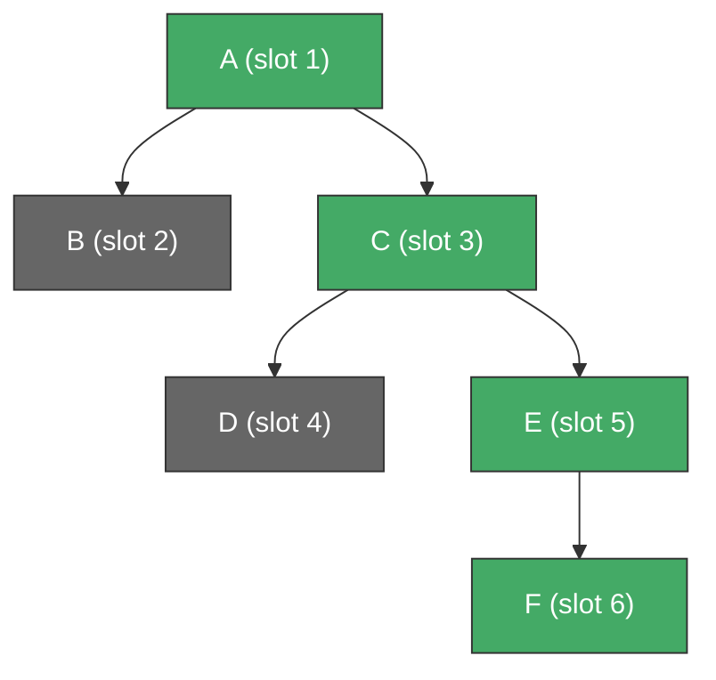

# Block Tree Model

A blockchain with forks is modeled as a **rose tree** of blocks.
The chain follower sees a deterministic traversal of this tree and
must arrive at the same state as if it had processed only the
canonical (true) chain.

## Rose tree

Each node holds a block (slot + mutation). Children are ordered
left-to-right: leftmost branches are explored first, the
**rightmost** child is the canonical continuation.



In this example, the **canonical path** (green) is A -> C -> E -> F.
Nodes B and D are non-canonical branches.

## DFS walk

The chain follower sees a left-to-right depth-first traversal.
For each subtree rooted at a fork:

1. Forward the root block.
2. Recurse into children left-to-right.
3. Between non-rightmost children, emit a **rollback** to the
   fork's slot.

For the tree above, the DFS walk is:

| Step | Event | State after |
|------|-------|-------------|
| 1 | Forward A | {A} |
| 2 | Forward B | {A, B} |
| 3 | Rollback to slot 1 | {A} |
| 4 | Forward C | {A, C} |
| 5 | Forward D | {A, C, D} |
| 6 | Rollback to slot 3 | {A, C} |
| 7 | Forward E | {A, C, E} |
| 8 | Forward F | {A, C, E, F} |

The final state matches the canonical path A -> C -> E -> F.

## Canonical path

The canonical path is the rightmost path from root to leaf.
It represents the "true" chain -- the one the consensus protocol
has selected. The main theorem in the Lean formalization proves
that processing the DFS walk (with rollbacks) produces the same
final state as processing the canonical path directly.

## Well-formedness

A tree is **well-formed** with respect to stability window K if
every non-rightmost subtree has depth at most K. This reflects
the consensus guarantee: forks cannot exceed K blocks.

!!! note "Stability window constraint"
    Well-formedness ensures that the chain follower never needs
    to undo more than K blocks at once. This bounds the rollback
    store size and guarantees that `rollbackTo` always has
    sufficient inverse data.

Formally:

```
wellFormed K (fork b children) =
    (forall c in dropLast children, depth c <= K)
    AND (forall c in children, wellFormed K c)
```

## Lean formalization

The block tree model, DFS walk, canonical path extraction, and
the main equivalence theorem are formalized in:

- [`ChainFollower.BlockTree`](https://github.com/lambdasistemi/chain-follower/blob/feat/rollback-support/lean/ChainFollower/BlockTree.lean)
  -- tree types, `dfs`, `canonical`, `wellFormed`, `processEvents`,
  and the correctness proof.
