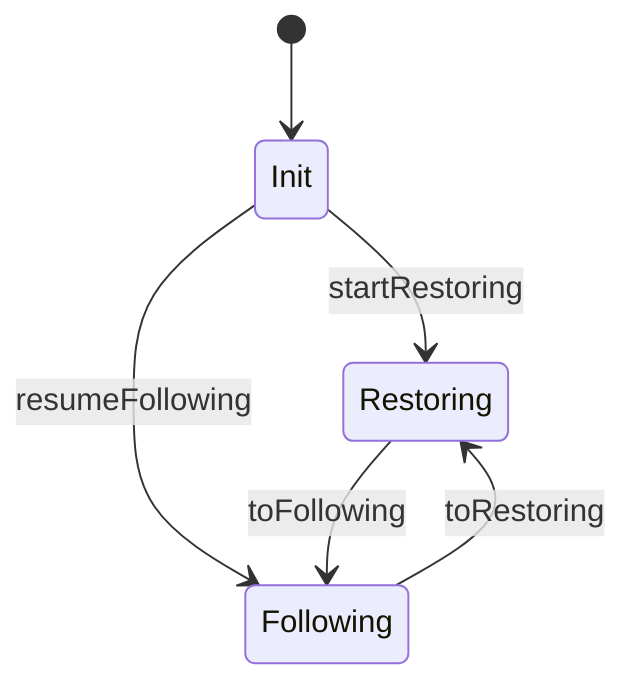

# Core Concepts

## Chain follower

A chain follower is a state machine that sits between a **chain source**
and a **backend**. The chain source delivers blocks and rollback signals.
The backend processes blocks and maintains application state. The chain
follower manages the protocol between them: initialization, phase
transitions, rollback storage, and finality pruning.

The follower itself is stateless in the functional sense -- each callback
returns the next continuation to use, forming a state machine without
mutable references.

## Phases

The chain follower operates in one of two phases:

**Restoration** -- bulk ingestion from genesis (or a snapshot). The
backend processes blocks at full speed with no inverse computation,
no rollback support, and no queryable state. This is the fast path
for catching up.

**Following** -- near the chain tip. Each block produces inverse
operations that the chain follower stores atomically alongside the
backend's mutations. Rollbacks are supported. The backend's state
is queryable.

The chain follower decides when to transition based on external signals
(proximity to the chain tip). The backend always offers both transition
options via its CPS continuations.

See [Phases](phases.md) for the full lifecycle.

## Rollback

When the chain source signals a rollback (fork switch), the chain
follower must undo blocks back to the fork point. It does this by
replaying stored inverse operations in reverse order.

The inverse operations come from the **swap partition model**: every
mutation displaces the old value at its key, and the displaced value
*is* the inverse. This is an involution -- applying the inverse undoes
the mutation exactly.

See [Swap Partition](swap-partition.md) for the formal model.

## Init

On startup, the chain follower runs an initialization protocol:

1. Query the rollback store for the last checkpoint (slot + point).
2. Based on the checkpoint, choose a phase:
    - **No checkpoint** -- call `startRestoring` on the backend.
    - **Checkpoint near tip** -- call `resumeFollowing` on the backend.
3. Negotiate an intersection point with the chain source via the
   `Intersector` protocol.
4. Begin processing.

The backend's [`Init`](https://github.com/lambdasistemi/chain-follower/blob/feat/rollback-support/lib/ChainFollower/Backend.hs)
record provides both setup actions; only the chosen one is executed.

## Stability window

The stability window **K** is the maximum fork depth guaranteed by the
consensus protocol. No rollback can exceed K blocks. This constrains
the block tree model: all non-canonical branches have depth at most K.

In practice, K determines how many rollback points the chain follower
must retain. Points older than K slots behind the tip are *final* and
can be pruned via `pruneOldPoints`.

See [Block Tree](block-tree.md) for how K constrains the tree structure.
