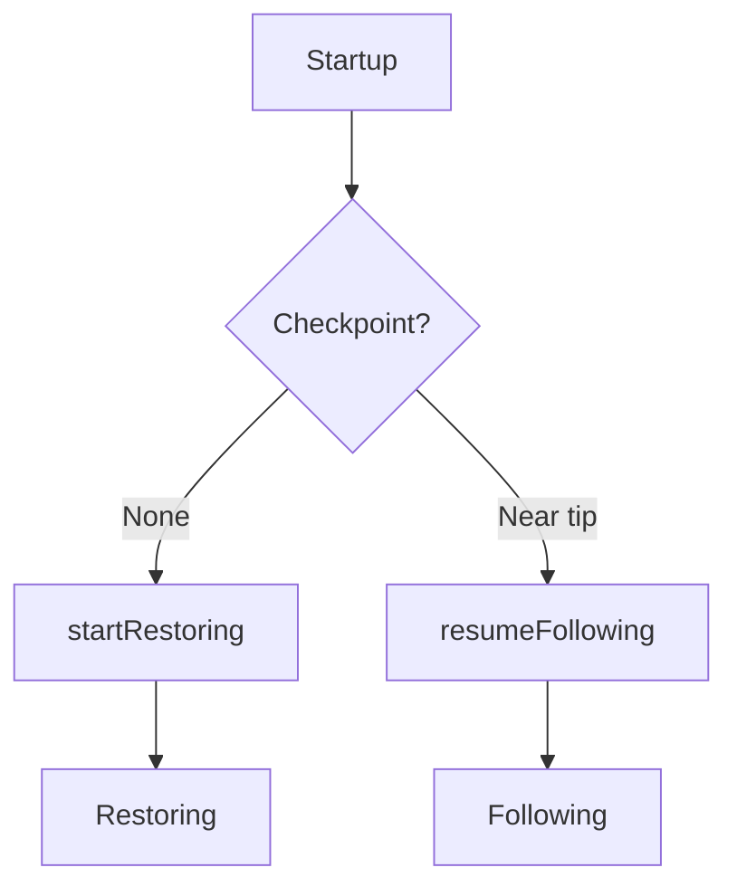
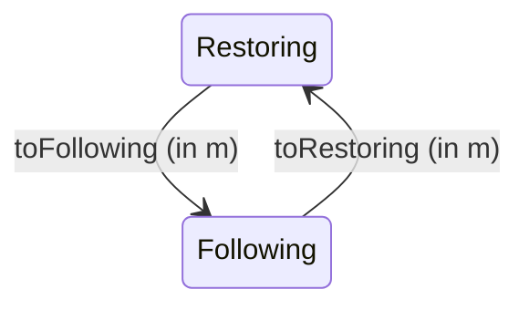

# Phase Lifecycle

The chain follower operates in two phases with well-defined
transitions between them. The backend exposes both phases as
CPS continuations -- the chain follower picks which to call.

## Restoring

Bulk ingestion mode. Used when catching up from genesis or a
snapshot, far from the chain tip.

**Properties:**

- `restore :: block -> t (Restoring m t block inv)` -- ingest one
  block in the transaction monad. Returns the next continuation.
- No inverse operations are computed or stored.
- No rollback support -- if a rollback arrives, the chain follower
  must re-intersect.
- Backend state is not queryable.
- Maximum throughput: no per-block overhead beyond the mutation itself.

**Transition out:** `toFollowing :: m (Following m t block inv)` --
runs in the outer monad (IO) to allow journal replay, cursor setup,
or other side effects.

## Following

Near-tip mode. Used when the chain follower is close to the chain
tip and must handle rollbacks.

**Properties:**

- `follow :: block -> t (inv, Following m t block inv)` -- process
  one block. Returns the inverse operations **and** the next
  continuation. Both are produced in the same transaction.
- Inverse operations are stored atomically in the rollback store
  (same transaction as the backend's mutations).
- Rollbacks are supported via `applyInverse :: inv -> t ()`.
- Backend state is queryable.

**Transition out:** `toRestoring :: m (Restoring m t block inv)` --
runs in the outer monad for cleanup.

## Initialization

On startup, the chain follower queries its checkpoint and tells the
backend which phase to prepare:

The [`Init`](https://github.com/lambdasistemi/chain-follower/blob/feat/rollback-support/lib/ChainFollower/Backend.hs)
record provides both setup actions:

- `startRestoring :: m (Restoring m t block inv)` -- initialize
  for bulk ingestion. Called when there is no checkpoint or the
  chain follower is starting fresh.
- `resumeFollowing :: m (Following m t block inv)` -- resume
  near-tip following. Called when a checkpoint exists close to
  the tip. The backend may replay journals, restore cursors, etc.

Only one of these is executed per startup.

## Phase transitions

Transitions run in the outer monad `m` (typically IO), **not** inside
a block-level transaction. This is intentional: transitions may involve
heavy IO (journal replay, cursor teardown, state snapshot) that should
not hold a transaction lock.

!!! note "Who decides?"
    The chain follower decides when to transition, based on external
    signals (e.g., proximity to tip reported by the chain source).
    The backend always offers both options -- it never refuses a
    transition.

!!! warning "Restoring has no rollback"
    If a rollback signal arrives during restoration, the chain
    follower cannot undo blocks (no inverse log exists). It must
    re-intersect with the chain source and potentially restart
    restoration from an earlier point.

## Source

- [`ChainFollower.Backend`](https://github.com/lambdasistemi/chain-follower/blob/feat/rollback-support/lib/ChainFollower/Backend.hs)
  -- `Restoring`, `Following`, `Init`, lifting functions
