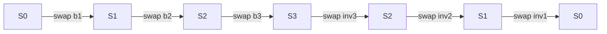

# Swap Partition Model

The rollback mechanism is built on a simple algebraic model: the
**swap partition**. Every state mutation is a swap that displaces
the old value. The displaced value is the inverse operation.

## State as a total function

The state of a key-value store is a total function:

```
State : Key -> Val
```

where `Val = Value | empty`. Every key maps to exactly one element
(possibly `empty`). This is an invariant preserved by construction.

## The swap operation

Every mutation -- insert, delete, update -- is a **swap**. Given a
binding `(k, v)` and a state `S`:

1. Read the current value at `k`: `old = S(k)`.
2. Write the new value: `S' = S[k := v]`.
3. The displaced binding `(k, old)` is the **inverse**.

Insert, delete, and update are all the same operation with different
value types:

| Operation | Incoming binding | Displaced binding |
|-----------|-----------------|-------------------|
| Insert `k v` | `(k, some v)` | `(k, empty)` |
| Update `k v` | `(k, some v)` | `(k, some old)` |
| Delete `k` | `(k, empty)` | `(k, some v)` |

## Involution

The swap operation is an **involution**: applying it twice restores
the original state.

```
swap(swap(S, b)) = S
```

This is proved as `swap_inverse_restores` in the Lean formalization.

!!! note "Why involution matters"
    Because swap is self-inverse, we do not need a separate "undo"
    operation. The displaced binding *is* the undo. The same `swap`
    function applies both forward mutations and rollback operations.

## Multi-step rollback

For a sequence of N swaps, each swap produces one displaced binding.
The sequence of displaced bindings forms the **inverse log** (in
forward order).

To roll back all N steps: replay the inverse log **in reverse**.

```
rollback(S', reverse(invLog)) = S
```

This is the main correctness theorem `rollback_restores` in Lean.



## Conservation

The universe of `Key x Val` is partitioned into two disjoint sets:

- **S** (state): for each key, exactly one pair `(k, _)`.
- **W** (world): everything else.

Every swap moves one binding from W into S and one from S into the
inverse log (a subset of W). The cardinality `|S| = |Keys|` is
invariant.

!!! warning "Not a Set partition in general"
    The "partition" is conceptual. In the implementation, the inverse
    log may contain duplicate keys (from multiple mutations to the
    same key). The algebraic properties still hold because each swap
    is independently invertible.

## Source links

**Lean formalization:**

- [`ChainFollower.SwapPartition`](https://github.com/lambdasistemi/chain-follower/blob/feat/rollback-support/lean/ChainFollower/SwapPartition.lean)
  -- `State`, `Binding`, `swap`, `applySwaps`, `applySwaps_append_fst`
- [`ChainFollower.Rollback`](https://github.com/lambdasistemi/chain-follower/blob/feat/rollback-support/lean/ChainFollower/Rollback.lean)
  -- `swap_inverse_restores`, `rollback_restores`, `swap_commute`

**Haskell implementation:**

- [`ChainFollower.Rollbacks.Types`](https://github.com/lambdasistemi/chain-follower/blob/feat/rollback-support/lib/ChainFollower/Rollbacks/Types.hs)
  -- `Operation`, `inverseOf`, `RollbackPoint`
