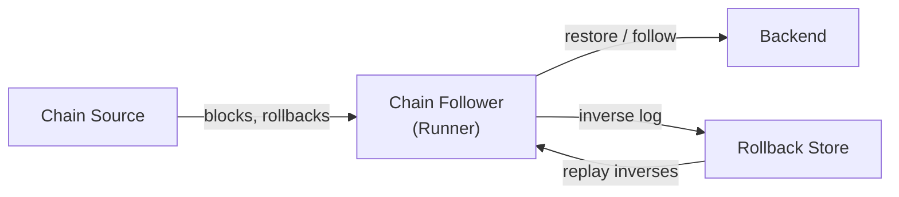

# Chain Follower

A generic blockchain synchronization library with rollback support,
phase management, and formally verified correctness guarantees.

## What it does

Chain Follower sits between a **chain source** (a node, relay, or mock)
and a **backend** (your application state). It manages the full
lifecycle of block ingestion: bulk restoration from genesis,
near-tip following with rollback support, and phase transitions
between the two.

## Key features

- **Two-phase lifecycle** -- bulk restoration (fast, no inverses) and
  near-tip following (rollback-capable). See [Phases](concepts/phases.md).
- **Swap-partition rollback model** -- every mutation displaces the old
  value; displaced values form the inverse log. Replaying in reverse
  restores any previous state. See [Swap Partition](concepts/swap-partition.md).
- **Formally verified** -- core invariants (involution, rollback
  correctness, DFS/canonical equivalence) proved in Lean 4.
- **Backend-agnostic** -- the backend is a CPS record; plug in any
  storage layer that supports transactions.
- **Atomic rollbacks** -- inverse operations are stored in the same
  transaction as the backend's mutations.

## Documentation map

| Section | Contents |
|---------|----------|
| [Concepts](concepts/overview.md) | Core abstractions: phases, rollback, block tree, stability window |
| [Architecture](architecture/modules.md) | Module map, runner, rollback store, backend interface |
| [Lean Formalization](lean/overview.md) | Formal proofs and theorem index |
| [Testing](testing/laws.md) | Property-based laws and test strategy |
| [Tutorial](tutorial/running.md) | Running the tutorial executable |
