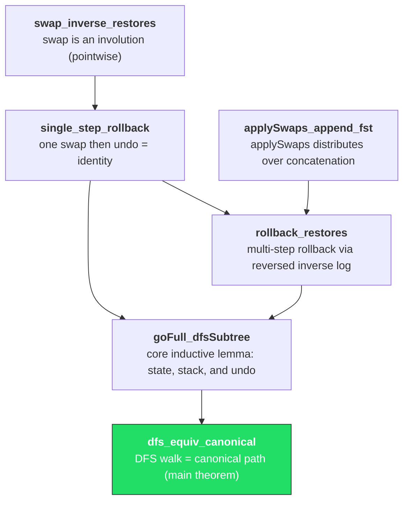

# Lean Formalization Overview

The `lean/` directory contains a machine-checked proof that the chain follower's
rollback mechanism is correct. The proofs are written in
[Lean 4](https://lean-lang.org/) and verify that processing a DFS walk of a
block tree with rollbacks produces the same final state as applying the canonical
chain directly.

## Source files

| File | Purpose |
|------|---------|
| [`SwapPartition.lean`][swap-src] | State model, swap operation, `applySwaps` distributivity |
| [`Rollback.lean`][rb-src] | Swap involution, single/multi-step rollback correctness |
| [`BlockTree.lean`][bt-src] | Block tree, DFS walk, canonical path, main equivalence theorem |

[swap-src]: https://github.com/lambdasistemi/chain-follower/blob/feat/rollback-support/lean/ChainFollower/SwapPartition.lean
[rb-src]: https://github.com/lambdasistemi/chain-follower/blob/feat/rollback-support/lean/ChainFollower/Rollback.lean
[bt-src]: https://github.com/lambdasistemi/chain-follower/blob/feat/rollback-support/lean/ChainFollower/BlockTree.lean

## What is proven

The formalization establishes that:

1. **Swap is an involution** -- applying a swap and then its inverse restores the
   original state exactly (`swap_inverse_restores`).
2. **Multi-step rollback works** -- replaying the inverse log in reverse order
   undoes an arbitrary sequence of mutations (`rollback_restores`).
3. **DFS walk equals canonical path** -- for any well-formed block tree, the
   chain follower's event-driven state machine (forward + rollback) produces
   the same state as applying only the canonical (rightmost) path
   (`dfs_equiv_canonical`).

## What is assumed

- **Slot ordering**: blocks in the tree have strictly increasing slots from
  parent to child (`allSlotsGt`, `slotsOrdered`). This mirrors the real
  blockchain constraint.
- **Well-formedness**: non-rightmost branches have depth bounded by the stability
  window K (`wellFormed`). This is a consensus-layer guarantee.
- **Deterministic key-value state**: the state is modeled as a total function
  `Key -> Val` (no partial maps, no concurrency).

No axioms beyond Lean's core are used. All proofs are fully constructive.

## How the Lean model maps to Haskell

| Lean concept | Haskell counterpart |
|---|---|
| `State κ α` (total function `κ -> Val α`) | `Backend` column families (RocksDB) |
| `swap s b` returning `(s', displaced)` | `processBlock` writing a mutation and storing the inverse |
| `applySwaps` collecting an inverse log | `Rollbacks.Store` accumulating undo entries per block |
| `rollback` via reversed inverse log | `rollbackTo` replaying stored inverses |
| `processEvents` (forward/rollBack events) | The chain follower's main loop reacting to chain source events |
| `canonical t` (rightmost path) | The final chain after all forks resolve |
| `dfs t` (full DFS walk) | The actual sequence of events the follower observes |

The Lean model is intentionally simpler: it omits databases, IO, and error
handling. The key insight it captures is that the swap-partition structure
guarantees rollback correctness regardless of how many forks occur.

## Proof structure

The proof builds in layers, each depending on the one below:

The bottom-up reading order is:

1. `swap_inverse_restores` -- the fundamental involution property.
2. `single_step_rollback` -- lifts involution to function extensionality.
3. `applySwaps_append_fst` -- structural lemma enabling the induction step.
4. `rollback_restores` -- combines the above into multi-step correctness.
5. `goFull_dfsSubtree` -- the hard inductive lemma on tree structure, proving
   three properties simultaneously: state correctness, stack shape, and
   rollback restoration.
6. `dfs_equiv_canonical` -- a one-line corollary extracting the state equality.

!!! note
    The inductive lemma `goFull_dfsSubtree` carries three conjuncts because the
    induction hypothesis for the multi-child case (`goFull_interleaveRollbacks`)
    requires all three to proceed. Proving state correctness alone is not
    strong enough for the induction to close.
