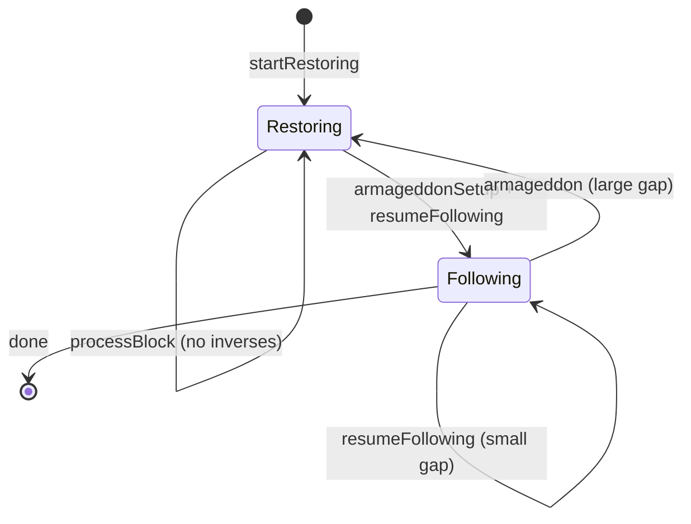

# Tutorial Walkthrough

A phase-by-phase explanation of the chain follower lifecycle tutorial.

Source: [`exe/Main.hs`][main-src]

[main-src]: https://github.com/lambdasistemi/chain-follower/blob/feat/rollback-support/exe/Main.hs

---

## Phase 1: Fresh Start (Restoration)

**What happens**: the database is empty. The follower begins in _restoration_
mode, bulk-ingesting historical blocks without storing inverse logs.

**Key operations**:

```haskell
mTip <- runTx $ Rollbacks.queryTip Rollbacks
r <- startRestoring backend
let phase0 = InRestoration r
```

The rollback tip is `Nothing` (no prior state). `startRestoring` returns the
restoration-phase backend. Blocks 1--15 are processed via `processBlock` inside
`foldPhase`.

**Output**: state snapshots at blocks 5, 10, and 15 showing balances
accumulating.

**Why it matters**: restoration is the fast path. During bulk sync from genesis,
there is no need to store inverses because rollback is impossible (the chain is
already finalized). This saves storage and write amplification.

---

## Phase 2: Transition to Following

**What happens**: the follower is now near the chain tip. The rollback sentinel
is set up, and the backend switches to _following_ mode where every mutation
stores its inverse.

**Key operations**:

```haskell
runTx $
    Rollbacks.armageddonSetup Rollbacks 15 Nothing
f <- resumeFollowing backend
let phase2start = InFollowing f
```

`armageddonSetup` initializes the rollback store with the current tip (slot 15).
`resumeFollowing` returns the following-phase backend. Blocks 16--20 are
processed, each storing its inverse bindings.

**Output**: state snapshots after each of blocks 16--20.

**Why it matters**: the transition from restoration to following is the critical
mode switch. After this point, every block can be rolled back.

---

## Phase 3: Simulate a Fork (Rollback)

**What happens**: the chain source reports a fork. Blocks 19 and 20 are on a
now-abandoned branch. The follower rolls back to slot 18 by replaying stored
inverses in reverse order.

**Key operations**:

```haskell
following3 <- extractFollowing phase2
result <- runTx $ rollbackTo Rollbacks following3 18
```

`rollbackTo` pops inverse entries from the rollback store for slots > 18 and
applies them, restoring the state to what it was after slot 18.

**Output**: the rollback result and a state snapshot showing the state has
returned to its post-slot-18 values.

**Why it matters**: this is the core rollback mechanism in action. The Lean proof
(`rollback_restores`) guarantees that this operation is correct for any sequence
of mutations.

---

## Phase 4: Follow the Forked Chain

**What happens**: new blocks 19--22 arrive on the forked (now canonical) chain.
The follower resumes following mode and processes them normally.

**Key operations**:

```haskell
f4 <- resumeFollowing backend
phase4 <-
    foldPhase
        runTx
        (InFollowing f4)
        [19 .. 22]
        ...
```

`resumeFollowing` picks up from the current rollback tip (slot 18 after
rollback). Blocks 19--22 are applied with inverse tracking.

**Output**: state snapshot after slot 22.

**Why it matters**: after a rollback, the follower seamlessly continues on the
new fork. The state now reflects the canonical chain: blocks 1--18 followed by
the forked blocks 19--22.

!!! note
    The tutorial uses deterministic `mkBlock`, so forked blocks have the same
    content as the original. In a real blockchain, forked blocks would contain
    different transactions.

---

## Phase 5: Small-Gap Restart (Within Stability Window)

**What happens**: the follower goes offline and comes back. The blockchain has
advanced from slot 22 to slot 25 -- a gap of 3 slots, which is within the
stability window (K=5). The follower stays in following mode and catches up.

**Key operations**:

```haskell
f5 <- resumeFollowing backend
phase5 <-
    foldPhase
        runTx
        (InFollowing f5)
        [23 .. 25]
        ...
```

No armageddon is needed. The rollback history still covers the gap, so the
follower can handle any forks that might have occurred during the downtime.

**Output**: state snapshot after slot 25.

**Why it matters**: small gaps are the common case for brief outages. The
follower resumes without re-syncing from scratch.

---

## Phase 6: Large-Gap Restart (Exceeds Stability Window)

**What happens**: the follower goes offline for a long time. The blockchain is
now at slot 40 -- a gap of 15 slots, exceeding the stability window. The
rollback history is insufficient to handle potential forks spanning that gap.
The solution is _armageddon_: wipe the database and re-restore the full
canonical chain.

**Key operations**:

```haskell
-- Cleanup loop
let cleanupLoop = do
        more <-
            runTx $
                Rollbacks.armageddonCleanup Rollbacks 100
        when more cleanupLoop
cleanupLoop

-- Reset sentinel
runTx $
    Rollbacks.armageddonSetup Rollbacks 0 Nothing

-- Re-restore
r6 <- startRestoring backend
_ <- foldPhase runTx (InRestoration r6) [1 .. 35] ...

-- Transition back to following
runTx $
    Rollbacks.armageddonSetup Rollbacks 35 Nothing
f6 <- resumeFollowing backend
phase6final <-
    foldPhase runTx (InFollowing f6) [36 .. 40] ...
```

This phase runs in a fresh temporary database to simulate the wipe.
`armageddonCleanup` removes all rollback entries in batches.
`armageddonSetup` resets the sentinel. The follower re-restores blocks 1--35
(the canonical chain up to the stability window boundary), transitions to
following mode at slot 35, and catches up through slot 40.

**Output**: state snapshots at slots 10, 20, 30, 35, and 40.

**Why it matters**: large gaps are the worst case. The follower cannot trust its
rollback history, so it must rebuild from scratch. This is expensive but
correct, and the verification phase proves it.

---

## Phase 7: Verification

**What happens**: the tutorial constructs the canonical chain events (blocks
1--18, rollback to 18, blocks 19--40) and resolves them to a flat block list. It
then runs a single-pass restoration in a fresh database and compares the result
against the state from Phase 6.

**Key operations**:

```haskell
let canonicalEvents =
        map (\s -> Forward s (mkBlock s)) [1 .. 18]
            ++ [RollBack 18]
            ++ map (\s -> Forward s (mkBlock s)) [19 .. 40]
    canonicalBlocks = resolveCanonical canonicalEvents

singlePassState <- withTempDB $ \runTx2 -> do
    r' <- startRestoring backend
    _ <- foldPhaseSimple runTx2 (InRestoration r') canonicalBlocks
    snapshotState runTx2

if finalState == singlePassState
    then putStrLn "  PASS: states match."
    else ...
```

A second verification checks that the Phase 5 state matches the canonical chain
truncated at slot 25.

**Output**: `PASS: states match.` (twice) if everything is correct.

**Why it matters**: this is the empirical counterpart of the Lean theorem
`dfs_equiv_canonical`. The lifecycle (restore, follow, rollback, fork, restart,
armageddon) produces the same state as a clean single-pass application of the
canonical chain.

---

## Lifecycle diagram


